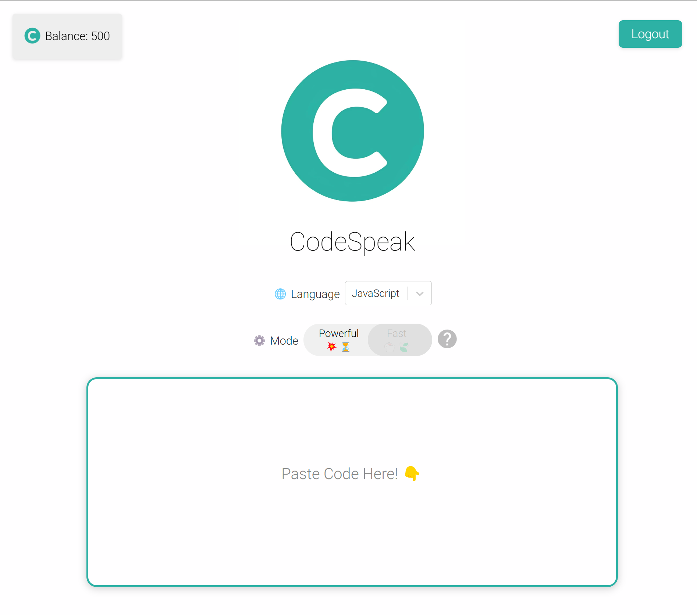

# CodeSpeak

Created by Kaden Oseen

CodeSpeak is an intuitive web-based application designed to convert inputted code into easy-to-understand language, helping both novice and experienced programmers better comprehend the functionality of their code. Users can select a programming language, input their code, and receive a human-readable interpretation of their code's logic.



## Table of Contents

1. [Features](#features)
2. [Technology](#technology)
3. [Installation and Setup](#installation-and-setup)
4. [Backend](#backend)

## Features

- **Code Input:** Allows users to input any code snippet into the provided text editor.
- **Language Selection:** Users can choose the language of the code they are inputting for accurate translations.
- **Powerful/Fast Mode Options:** Users can choose between powerful mode (pros: highest quality responses, cons: slower and uses more tokens) and fast mode (pros: fast and uses 5x less tokens, cons: lower quality output)
- **Real-time Feedback:** Users receive a human-readable interpretation of their code's logic upon submission.
- **Accounts:** Users can create an account, login and reset their password
- **Tokens:** Users are provided with 200 tokens to start off with to test out the application
- **Payment Processing:** Users can purchase additional tokens to use in the application

## Technology

CodeSpeak is built with React and TypeScript, providing a responsive and dynamic user interface. Code editing is facilitated by the Monaco Editor, and custom styles are written with CSS modules.

## Installation and Setup

### Prerequisites

Ensure you have Node.js and npm installed in your environment. 

### Clone the Repository

```bash
git clone https://github.com/kadenoseen/CodeSpeak.git
cd codespeak
```

### Install Dependencies
```bash
npm install
```

### Start the Application
```bash
npm start
```
Open your web browser and visit 'http://localhost:3000' to view the application.


## Backend

### Setup
#### Environment Variables
This application uses the following environment variables:
`OPENAI_API_KEY` - Your OpenAI API Key.
`STRIPE_TEST_KEY` - Stripe test key
`STRIPE_TEST_WEBHOOK` - Stripe webhook test key

#### Running the Application Locally
1. Install dependencies using `npm install`.
2. Setup Firebase:
  - Create a new Firebase project
  - Download the server-account.json file
  - Place the file in the root of the project directory
2. Build the TypeScript application using `npm run build`.
3. Run the server using `npm start`.

### API Endpoints
#### POST `/submit`
Converts provided code into spoken language.

Parameters
- code (required): The programming code to be translated.
- language (required): The language in which the code is written.

Example
```json
{
  "code": "for(int i = 0; i < 10; i++) { console.log(i); }",
  "language": "javascript"
}
```

Response
- The endpoint responds with a message containing the spoken language translation of the provided code.

#### POST `/webhook`
Receive webhook events from Stripe, add tokens to users after successful payments

#### POST `/create-checkout-session`
Creates a new stripe checkout session

### Deploying The Application
1. Run `npm run build` on the frontend application.
2. Move the `build` folder into the `backend` folder
3. Run `npm run build` on the backend to ensure typescript code is compiled
4. Deploy with an `app.yaml` file for Google App Engine, or use own deployment of `node dist/server.js` as entrypoint.
